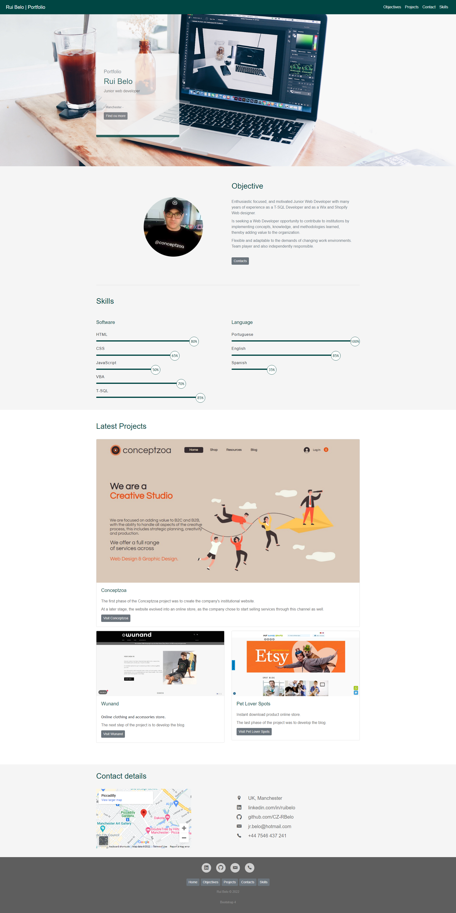

# Bootstrap Portfolio

### Repository

Bootstrap - Portfolio.  
An organized and effective way to show the projects that **Rui Belo** has been involved in this Bootcamp.

### Description

The **Bootstrap Portfolio** website is divided into 7 elements:

**Header**  
Includes a navigation bar with the brand name on the left and a link pointing to the Home Page, and on the right side are the **Objectives**, **Projects(current)**, **Contact**, **Skills** and  **Section Bio Box** links pointing to the respective sections on the website.

Right after the top bar, there is the "Silver Macbook Pro On a brown wooden table" image, which occupies the entire navigation element. 
And it has a floating bio box with a paragraph and a callout.

**Section Objective or About Me**  
A block of text where some of the soft skills and career goals are highlighted.
With a Call to Action button linked to the contacts section.

**Section Skills**  
Progress Bars with some of the Software and Languages skills.

**Section Projects**  
Section where will be published the most recent projects.
In each project, there is a Call to Action button with a link to the project homepage.

**Section Contact Details**  
Here is where the contacts are found.
Each type of contact has a direct link.

**Section Footer**  

The web page ends, with button links pointing to the respective sections on the website, and direct links to each type of contact.

### Mock-Up

The images below illustrates the **Rui Belo Portfolio** web page appearance:    

 
  
  
[Mobile web page mock-up version link](images/RB-BootsrapPortfolio-mobile-mockup.jpg) | [Tablet web page mock-up version link](images/RB-BootsrapPortfolio-tablet-mockup.jpg)

### Contributing

Why you should contribute to an open-source project?  
Contributing to open-source is a rewarding way to learn, teach, and build experience in just about any skill.
You don’t have to contribute code, there’s always a task for you on an open-source project.
Besides coding, you can contribute to user interface design, graphic design, writing, or organizing.

Ways you can contribute:

* [Submit bugs and feature requests](https://github.com/CZ-RBelo/Bootstrap-Portfolio/issues/)
* [Review source code changes](https://github.com/CZ-RBelo/Bootstrap-Portfolio/pulls)

> **Spell check errors**  
>Pull requests that fix spell-check errors are welcomed.  
>If you want to give feedback or report an issue, please create a [new GitHub issue](https://github.com/CZ-RBelo/Bootstrap-Portfolio/issues/new).  
>**Please check if a topic about your issue already exists!**

### Links

* [Github Repository](https://github.com/CZ-RBelo/Bootstrap-Portfolio)
* [Deployed Application](https://cz-rbelo.github.io/Bootstrap-Portfolio/)

### Credits

[Bootstrap 4](https://getbootstrap.com/)  
[Hero Box Background Photo by Reezky Pradata](https://www.pexels.com/photo/silver-macbook-pro-on-brown-wooden-table-441963)  
[Skills Progress Bar Design by Easy Tutorials](https://easytutorialspro.com/)  

### Contacts

If you require any further information, feel free to contact me at:
 
* Github Profile: [CZ-RBELO](https://github.com/CZ-RBelo/)  
* Email: [jr.belo@hotmail.com](mailto:jr.belo@hotmail.com)
* LinkedIn: [Rui Belo](https://linkedin.com/in/ruibelo)

---
### License
Licensed under the [MIT license](https://github.com/CZ-RBelo/Bootstrap-Portfolio/blob/main/LICENSE)